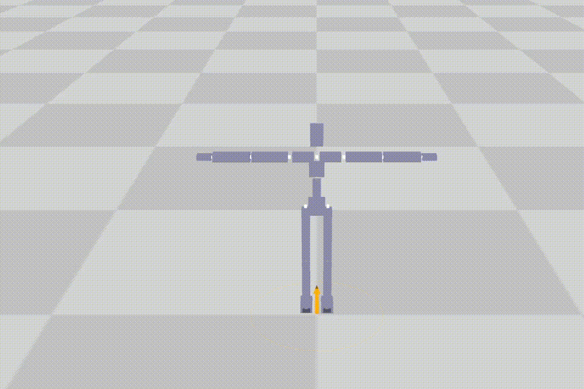
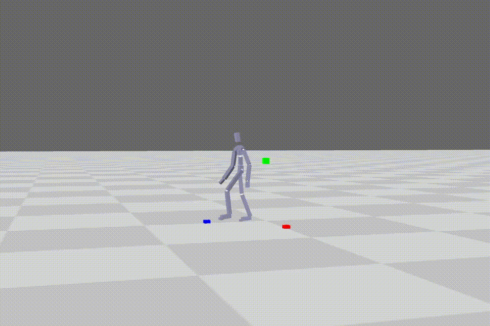
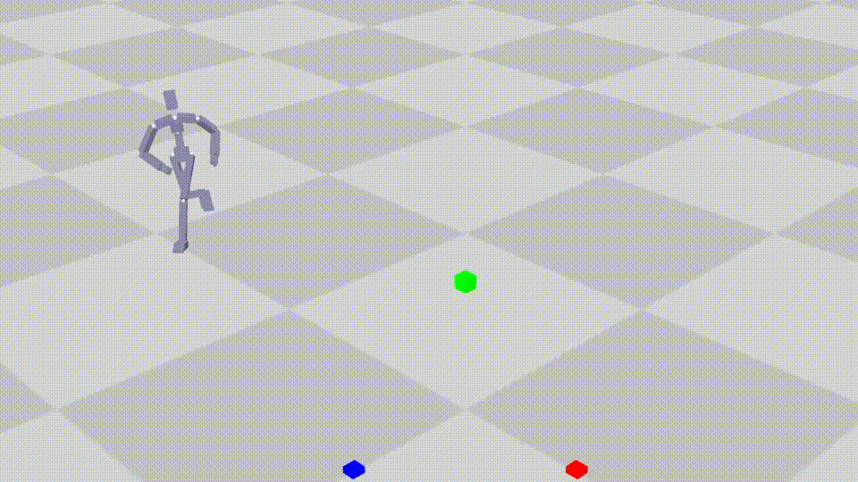
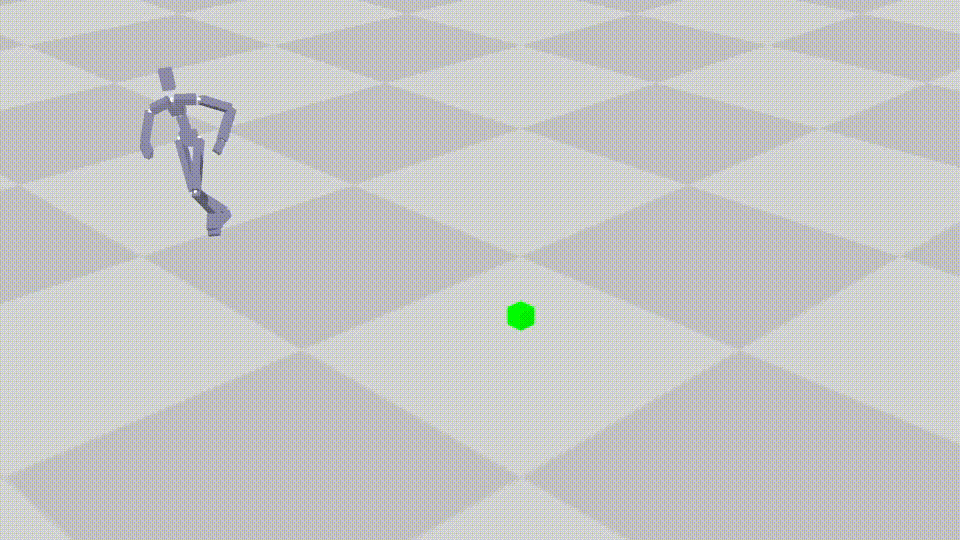
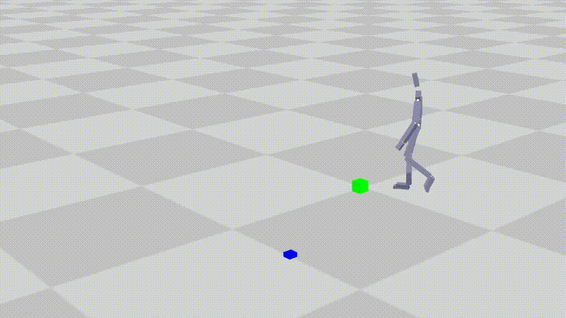
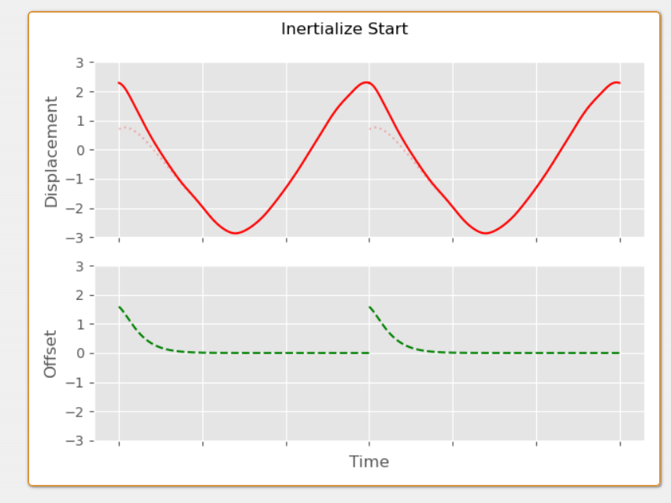
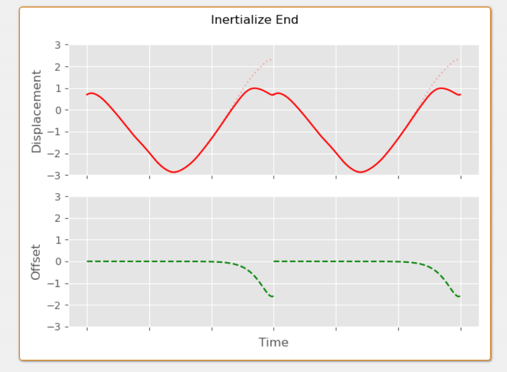
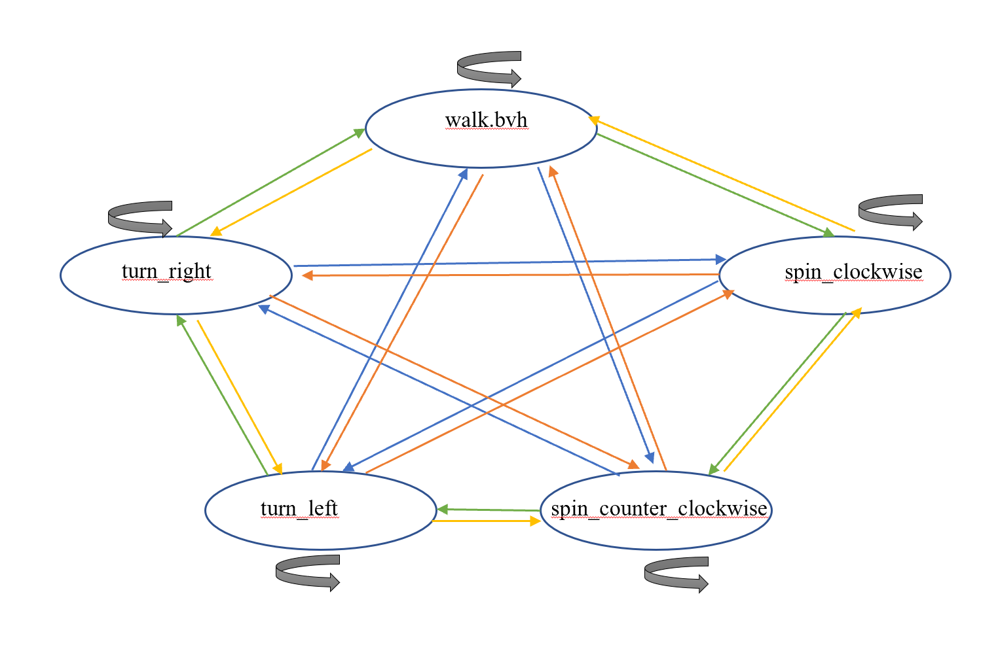

# 作业2

本次作业通过进一步应用lab1的FK知识以及插值拼接算法来完成对于动画的进一步处理，拟期望实现一个可交互的多动画角色。后半部分Task2将实现一个可交互的角色控制器，以进行驱动

--------------------------------------------
## 任务零  环境配置 （不赋分）
--------------------------------------------

### 1. 安装panda3d(Windows/Linux/Mac)
   
建议使用conda等建立新的虚拟环境
```bash
conda create -n games105 python=3.8
conda activate games105
conda install numpy scipy
pip install panda3d
```
如果下载过慢可使用清华镜像源安装 ( https://mirrors.tuna.tsinghua.edu.cn/help/anaconda/ )

> 本作业只允许使用 `numpy`， `scipy`，`pytorch`(`tensor-flow`, `jittor`)以及其依赖的库。评测时也以此为准。版本限定到2022年10月31日之前的发布版本。作业文件中请不要import除此之外的库。

完成后可以运行`task0_build_and_run.py`，你将会看到一个地面上的黄色圆圈。你可以通过键盘或左手柄来控制它的移动。可以通过鼠标左右中键或右手柄操作相机视角。(检测到手柄会无视键盘输入，具体情况请参考`task_0_build_and_run.py`的注释.)

<p align=center>
 
</p>

--------------------------------------------
## 任务一 动作拼接处理 （50分）
--------------------------------------------


在之前的lab1中你完成了对BVH数据的读入和前向/逆向运动学。而在这个部分你需要对运动数据们进行进一步的处理，从而为搭建自己的交互角色动画做准备。

在这里我们在文件`bvh_motion.py`里实现一个`BVHMotion`对象，它应该有读取BVH和前向运动学的功能，并且有一些简单的动作处理函数。 

我们统一让`position`，`rotation`为局部位置，旋转，`translation`,`orientation`为全局位置旋转。

和lab1不太相同的是，我们这次记录了每个joint有多少个channel(普通joint3个， 根节点和特殊joint有6个，且前三个为position后三个为rotation)。

需要注意的是，BVH中如果该关节有position channel， 则offset会被忽略， 而是把position channel的数字当作offset使用，相当于offset是时不变的position channel。 故而我们记录了`joint_position`这一(帧数x关节x3)的数组， 对3自由度关节，其始终是offset，而对有position的关节，其会填入position。

故而前向运动学可以简单地写为

```python
child_translation = parent_translation + parent_orientation.apply(child_position)
```

### part0: 熟悉BVHMotion class函数（5分）

我们的`BVHMotion`class的读取BVH功能给大家空出来了一个函数，需要同学帮忙补全。请注意，如果这个类的函数并没有正确补全，后续的任务不能进行。

`load_meta_data`函数为了读取BVH文件的`joint_name`,`joint_parent`,`joint_offset`。因为这个函数比较重要，我们打算让同学再次确保这个函数写的正确。请于`answer_task0.py`文件内用lab1的part1_calculate_T_pose函数补全BVHMotion class 的load_meta_data功能 。

假设得到两个从不同下载源得到的BVH文件，虽然BVH的标签是走路和跑步，但不一定朝着相同的方向。我们在拼接动作时，总是希望新动作第一帧和上一个动作的最后一桢位置相同，朝向相同，这样才能比较平滑地将其连接起来。由于这个功能几乎是所有动画拼接的算法的基础，作为福利，我们打算给出`translation_and_rotation`函数。这个函数是给定的Root Joint的位置，以及朝向的方向，把角色挪到该Root Joint的位置上，并且把全身的旋转调整到对应方向上。

对position的水平调整比较直观，就是

```python
res = self.raw_copy() # 拷贝一份，不要修改原始数据
offset = target_translation_xz - res.joint_position[frame_num, 0, [0,2]]
res.joint_position[:, 0, [0,2]] += offset
```

对于rotation的调整。课上讲过旋转`R`可以被分解为一个绕y轴的旋转`Ry`和一个绕xz平面上的轴的旋转`Rxz`，并且`R=RyRxz`。调整水平转向实际上是调整`Ry`。

当然，调整完rotation后，position需要进一步调整，否则会出现本来是向前走，现在是斜着走的问题。

所以请仔细阅读`bvh_motion.py`中`BVHMotion`class的`translation_and_rotation`函数，以及分解得到`R=RyRxz`的辅助函数`decompose_rotation_with_yaxis`。这个函数将会伴随所有的动作处理以及后面的interactive character的实现。

### part1: 动作插值 （15分）

有时候我们录了向前走路和跑步的动作，这些动作的运动速度是固定的。而现在我们需要新的速度的向前运动，可以通过对已有的动作进行插值得到。

对于两个pose，我们可以用线性插值(lerp)处理局部偏移(joint_position)，用slerp处理局部旋转，来形成一个新的pose。那么把对应的每一帧进行上述的操作，就可以形成一个新的motion序列。

请在`answer_task1.py`完成`blend_two_motions`函数。具体操作和提示可以看对应函数的注释。我们给出一个使用用线性插值(lerp)处理局部偏移(joint_position)，用slerp处理局部旋转的结果示意图，如下

<p align=center>

</p>

### part2：制作循环动画（15分）

我们提供的走路/跑步动画为左右脚各迈一步。那么如何获取一直向前走的动画呢？很简单，把它复制一次然后把新的动画初始位置与它原本的末尾位置对齐即可(使用part1的函数)。

然而，这个动作只是从长动作截取的一段，并不是一个完美的循环动画，直接的拼接会导致内容的突变。

故而如何把一个差不多循环的动作变成循环动作？一个简单而有效的想法是尽可能把原本的首尾差异抹平，并均摊到其他帧。

在本任务中，你可以使用类似于part1的lerp和slerp的方法。也可以去本文档后面的补充资料中了解一下一个在loop化经常使用的，被称作"inertialization"(惯性化)的方法。

请在`answer_task1.py`中完成`build_loop_motion`函数。完成后可以在`task1_motion_editing.py`的`part2_build_loop`是否启用`build_loop_motion`函数来观察不同。调节`ShowBVHUpdate`中的`speed_inv`可以调节播放速度。

我们在这里给出一个用inertialization完成loop化效果，应该如此

<p align=center>

</p>

区别于直接拼接有着周期性的动作突变，效果还是很明显的

<p align=center>

</p>

### part3: 动作拼接 （15分）

接下来一个问题是如何衔接两个动作，比如自然地从走路到跑步？

由于局部旋转不同，直接的拼接必然导致肉眼可见的突变。故而需要使用blend方法从一个动作平滑地过渡到另一个动作。

你需要实现`concatenate_two_motions`函数。函数输入的`mix_frame1`表示动作1的开始转移的帧数，`mix_time`表示转移用了几帧。实际上除了linear blend， 补充知识介绍的"inertialization"等方法也可以用于动作的拼接，并且不需要`mix_time`参数，我们不限定方法，最终会根据连接的平滑性和动作质量评分。

我们的测试用例是先跑再走再跑，我们会固定先使用part2的代码生成loop化的动画，对齐相位，并进行拼接，输入动画的处理可以参考`task1_motion_editing.py`的`part3_concatenate`。给出一个拼接后例子

<p align=center>

</p>

### 补充知识

下面给出一些可能用到的知识

#### 1.blend的一些tips

插值动作时，我们会面临动作长度不一的问题。因为一般走路，跑步动作都是左右脚各迈一次，速度不同必然导致动作时间不同。假设走路，跑步的速度为v1,v2，动作帧数为n1,n2(BVH内仅含一个周期的运动)。那么如果想获得速度为v3的动作，左右脚各迈一次的时间为

$$
n = \frac{w_1 * v_1 * n_1+w_2 * v_2 * n_2}{v}
$$

其中$w$为混合权重

$$
w_1 = \frac{v_2-v}{v_2-v_1}
$$

$$
w_2 = 1.0 - w_1
$$

如果把走路和跑步都当成做的一种单位周期的运动，应该保证两个要混合的地方的相位相同。也就是，新动作的k帧处应该用走路的i帧和跑步的j帧进行混合，他们的比例应该也是$k:i:j=n:n_1:n_2$。如果遇到不是整数的方式，可以进行BVH帧率的缩放(比如说lerp和slerp)，简单的操作也可以四舍五入取到整数帧(这个可能会有效果的变化)。

#### 2. inertialization

先稍微介绍一下临界阻尼弹簧(Critical Damping)。回想一下，一个弹簧的末端有一个小球，小球在粘弹性流体中运动，所受两个力，一个是弹簧的弹力，为线性力；一个是流体的粘滞阻力，大小和速度的大小成正比。上述微分方程可以总结为

$$
m\ddot{x} + \beta \dot{x} + kx =0
$$

当给出的参数满足$\beta=2m\omega$，$\omega=\sqrt{\frac{k}{m}}$（没有阻力的固有振动频率），此时不发生摆动，振幅衰减最快，被称作临界阻尼弹簧(Critical Damping)。

因此如果在第一帧之初，加上一个振幅之差，我们可以调节半衰期(其可以表示衰减快慢)，我们希望经过一个周期后，将这个加上的振幅之差衰减没。于是完成平滑的Loop的效果。我们给出两个周期的动画举个例子，第一种情况是加上Positon(t0)-Position(tT)的差距，模拟的是第一个周期的效果：

<p align=center>

</p>

当然也可以加上加上Positon(tT)-Position(t0)的差距，模拟的是第二个周期的效果：
<p align=center>

</p>

这两种方法都可以，一般情况下，用这两种情况的一个混合效果作为Postion的变化值。当然Rotation的话，也类似，不过更新的话要用`offset_rot * R.from_quat(rotations[i])`的形式。

由于比较复杂，我们为大家提前写好了一个辅助文件`smooth_utils.py`。里面含有按照临界阻尼作用Position和Rotation的函数。如果使用"inertialization"的方法，请利用`smooth_utils.py`来在`answer_task1.py`中的part2的`build_loop_motion`函数进一步实现loop motion的制作。

对于本版块，可以进一步阅读并参考[Creating Looping Animations from Motion Capture](https://theorangeduck.com/page/creating-looping-animations-motion-capture)的前几页，其后几页是讲更加精细的loop操作。我们这个part的图也是截取自该blog。关于里面应用到的弹簧振子半衰期等概念也可以阅读该blog的其他版块，如[The Game Developer's Spring-Roll-Call](https://theorangeduck.com/page/spring-roll-call)

--------------------------------------------
## 任务二 可交互角色动画 (50分)
--------------------------------------------
你将在这一部分中实现一个简单的可交互角色动画：通过对动作捕捉数据的选择和拼接，使虚拟角色根据键盘/手柄的控制执行相应的动作。你需要完成的代码在`answer_task2.py`，实现后，运行`task2_interactive_character.py`查看效果。

我们使用两个class去实现可交互动画。一个是 Controller，位于 `viewer/controller.py` ，它根据手柄或者键盘信号 $a_{input}$ 来计算角色的移动目标 $d_{desired}$ ；另一个是你需要在 `answer_task2.py` 编写的 CharacterController，其功能是根据输入的 $d_{desired}$ 选择合适的动作，并根据该动作更新角色状态 $s$ 。

在 `answer_task2.py` 里的 update_state 函数中，你可以获得 Controller 类计算出的 $d_{desired}$，包括目标位置（desired_pos）、朝向（desired_rot）、线速度（desired_vel）、角速度（desired_avel）等信息，其中朝向为主要控制目标，位置、速度等信息在本任务中仅作参考，如不需要可以忽略。这些信息以列表的形式给出，代表未来第 (0, 20, 40, 60, 80, 100) 帧时角色的目标状态。其中 0 对应当前状态， 100 对应用户的控制输入 $a_{input}$。 而 (20, 40, 60, 80) 则对应经过惯性化平滑处理过的输入（惯性化部分请参考任务一补充资料的第二点）。

`motion_material` 目录下给出的几个新的用于本 task 的动作数据文件，包括有5个 bvh：
```
walk.bvh 向前直走
spin_clockwise.bvh 顺时针转弯
spin_counter_clockwise.bvh 逆时针转弯
turn_left.bvh 向左90度转弯
turn_right.bvh 向右90度转弯
```
你需要利用这5个bvh，来实现一个可以交互的角色控制器。注意这5个 bvh 已经调整为从大致相同的姿态开始和结束。

我们在 `graph.py` 给出一个简单的 Motion Graph 的定义，以及一个表示本任务中动作连接关系文件 `nodes.npy`。由于所有的动画 clip 都已大致对齐，所以每一个动画都可以和其他动画发生 transition。示意图如下

<p align=center>

</p>

你可以运用 task1 介绍的任何函数和方法来使得你的动画质量变得更好。

Motion Graph 的 Interactive Control 可以细分为3个任务

1. 我们提供了一个预先计算好的 Motion Graph，其中有向图的节点 (node) 表示某个动画，有向边 (edge) 表示前一个动画结束后可以连接（transit）到后一个动画。为了实现交互，你需要完成 update_state，使其可以根据目标状态 $d_{desired}$ ，遍历当前 node 对应的transition motion，并挑选出恰当的 transition motion。注意：你不一定需要使用 $d_{desired}$ 的全部信息。如果需要，你可以在 `answer_task2.py` 中添加更多的函数。

2. 在1. 的基础上，你需要正确的更新角色的位置和朝向，以保证 transition 前后角色位置不发生跳变

3. 在2. 的基础上，你需要使用合适的插值/平滑方法，使角色的姿势在 transition 前后保持连贯

我们最后以实际运行效果判断，按照动作切换连续性，动作自然程度进行评分。

- 通过： 能够响应输入，但是上面评分标准中有一项或以上有较大缺陷
- 优良： 上述评分标准无较大缺陷，或缺陷不明显(如较小的脚底打滑等)

这里给出一个简单实现的控制效果，相信你可以做的更好 :-)

<p align=center>

</p>

--------------------------------------------
## 提交
--------------------------------------------

需要提交的文件是``answer_task0.py``,`answer_task1.py`和`answer_task2.py`。最终上交时请只交这三个文件，打包成zip格式。
