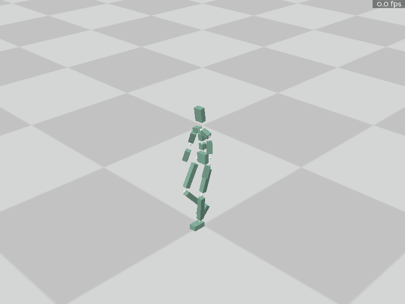

# 作业3

## 任务零  环境配置

### 1. 安装panda3d和MoCCASimuBackend(Windows/Linux/Mac)
   
Windows建议使用conda等建立新的虚拟环境
```bash
conda create -n MoCCA python=3.8
conda activate MoCCA
conda install numpy scipy
pip install panda3d
```
MacOS环境建议使用virtualenv建立新的虚拟环境
```bash
python3 -m venv MoCCA
source MoCCA/bin/activate
pip install numpy scipy
pip install panda3d
cd MoCCASimuBackend
pip install .
```
如果下载过慢可使用清华镜像源安装 ( https://mirrors.tuna.tsinghua.edu.cn/help/anaconda/ )

> 本作业只允许使用 `numpy`， `scipy`以及其依赖的库。评测时也以此为准。作业文件中请不要import除此之外的库。

> MoCCASimuBackend为本次作业的仿真后端，需要使用cmake进行编译，MacOS可以使用brew安装（需要先安装homebrew）
```bash
brew install cmake
```
目前提供了Windows上编译好的动态链接库（python3.8和3.10版本），不需要安装了。
> 如果在import MoCCASimuBackend时遇到numpy有关的报错，请更新numpy版本>=1.23，并卸载后重新编译安装。

完成后可以运行`task0_build_and_run.py`，你将会看到一个起始T-pose的角色，随着物理仿真他会跌倒在地上。

<p align=center>
 
</p>

## 任务一 动作控制

### part1 PD Control

为了能够在物理仿真环境中控制角色的运动，我们一般需要在角色的关节上施加力矩。一般来讲我们希望施加的力矩能够让关节呈现我们期望的角度。在本节我们实现简单的PD控制器来完成这一任务。

<p align=center>
 
</p>

这里你需要完成`part1_cal_torque`函数。其输入包含了一个`PhysicsInfo`对象，通过这个对象你可以获取当前的仿真状态如位置朝向速度角速度等。

> 物理中的关节一般没有朝向定义，此处朝向/角速度都是用子body的朝向/角速度代替

除此之外还会输入目标的pose和一个参数列表`kargs`，方便后续调用时更改指定的`kp, kd`，具体用法可以参考python语法教程如[Python 的 *args和 **kwargs](https://zhuanlan.zhihu.com/p/50804195)。

该函数返回在每个关节施加的关节力矩。对于每个关节，子link和父link将被施加大小相等方向相反的力矩，且`root`关节的力矩将会被无视掉。

<p align=center>
 
</p>

注意返回的关节力矩的表示是在全局坐标下。强烈建议先在每个关节的父亲坐标系下计算pd力矩再转换为全局坐标下的。并且为了避免过大的力矩，建议对其进行一定的clip。

> 仿真细节： 正如课上讲的，稳定的PD控制需要非常小的仿真步长。故而Viewer的更新频率依然是60FPS，但是每次更新时会进行多步仿真，通过substep指定。默认substep=32，即仿真频率是1920FPS。每个substep执行之前都会根据当前仿真状态重新计算一次pd控制力矩并施加上去。

> PD控制的目标速度我们目前认为是0即可。

在实现后可以获得一个走路的动作，由于没有控制根节点，角色会向前摔倒，你最终会看到角色倒在地上挣扎着做出走路的姿态。

<p align=center>
 
</p>

### part2: Hand of God

简单的PD控制很难让角色维持平衡。一些工作选择了在根节点上施加一个辅助外力来辅助平衡。这会导致一定的不物理，但是确实能够帮助保持平衡。在本节你需要计算出这个外力的方向和大小，当然，还是使用PD控制。

你需要完成`part2_cal_float_base_torque`，其中额外输入了目标的根节点位置，你可以从`PhysicsInfo`中获取根节点当前的物理信息。函数返回在根节点施加的辅助外力和力矩(世界坐标)，以及每个关节的力矩(世界坐标)，其中在根节点上施加的辅助力矩应该就是part1中被无视掉的`root`关节力矩。你可以调用part1的函数并通过kargs更改kp,kd。这里计算出的根节点辅助力在之后的仿真中只会保留竖直方向的力，即不让角色摔倒，是角色往前走的力仍然来自脚与地面的摩擦。

完成后你可以看到角色在竖直外力的辅助下磕磕绊绊的往前走，效果如下：

<p align=center>
 
</p>

### part3: Static Balance

为了让角色运动符合真正的物理规律，我们实际上不能在根节点上施加外力。回忆课上讲的Jacobian Transpose方法可以通过在脚踝等关节上施加力矩来模拟这个外力的作用。

<p align=center>
 
</p>

在这一节中，角色自然站立在地面上，并且会受到环境施加的随机外力。你需要实现这样一个方法，计算出不需要辅助外力就可以保持平衡的力矩，使得角色可以一直站立。

<p align=center>
 
</p>

