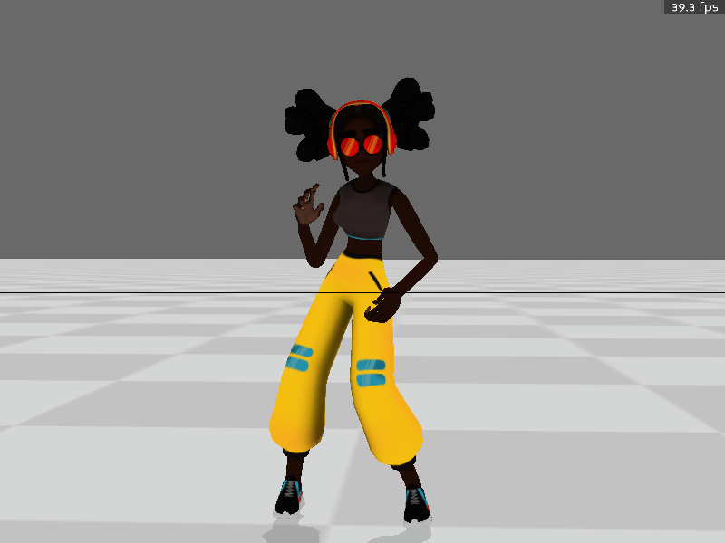

# 作业4

## 任务零  环境配置

### 1. 安装panda3d(Windows/Linux/Mac)
   
建议使用conda等建立新的虚拟环境
```bash
conda create -n MOCCA python=3.8
conda activate MOCCA
conda install numpy scipy
pip install panda3d
```
如果下载过慢可使用清华镜像源安装 ( https://mirrors.tuna.tsinghua.edu.cn/help/anaconda/ )

> 本作业只允许使用 `numpy`， `scipy`，`pytorch`(`tensor-flow`, `jitter`)以及其依赖的库。评测时也以此为准。版本限定到2022年10月31日之前的发布版本。作业文件中请不要import除此之外的库。

在运行代码前，请参考[Blend2Bam](./Blend2Bam.md)的方式将`material/test.gltf`转化为`bam`文件，并存储为`material/test.bam`。

完成后可以运行`task0_build_and_run.py`，你将会看到一个带有蒙皮的T_pose人物


<p align=center>
 
</p>

## 任务一: 简单蒙皮

这次我们的任务很简单：给出了骨骼动画和对应的蒙皮信息，让蒙皮跟随着骨骼动画运动吧！

我们给出了一个模型，以及与模型骨骼对应的bvh。模型本质上是一个Mesh，由一个个顶点连接成的三角面片组成。你的任务就是给出顶点跟随骨骼运动的函数`answer_task1.py\skinning`（下图是LBS原理）。

<p align=center>

</p>

这里为了方便，我们假设每个顶点最多被四个骨骼控制，我们给出了它受这四个骨骼影响的权重。

使用Linear Blend Skinning 正确完成`skinning`函数后，你能在part1看到一个固定姿态，在part2看到一个跳舞的角色。

<p align=center>

</p>

> 提示： python的for循环非常慢，而我们的模型有几万个顶点，将其用for循环遍历是十分不明智的。请充分利用numpy和scipy的batch操作并行计算。

## 任务二：Skinning with Dual Quaternions

正如课上所讲，LBS虽然简单方便，但是在极端情况下可能会出现问题，如下图所示

<p align=center>

</p>

而dual quaternion方法可以规避这个问题，在此任务中，你需要实现Skinning with dual quaternion。其接口在`answer_task2.py\dq_skinning`，输入输出和task1完全相同。

运行part3函数，我们给出的pose是将右腿绕y轴旋转180度。下图展示了LBS(左)和DQS(右)的差别：

<p align=center>
 
</p>


> 原论文参考网址 https://users.cs.utah.edu/~ladislav/dq/index.html， 其提供的c代码可能对你有些帮助。但注意他默认四元数是(w,x,y,z)格式，和scipy不同


## 提交

需要提交的文件是`answer_task1.py`和`answer_task2.py`。 
